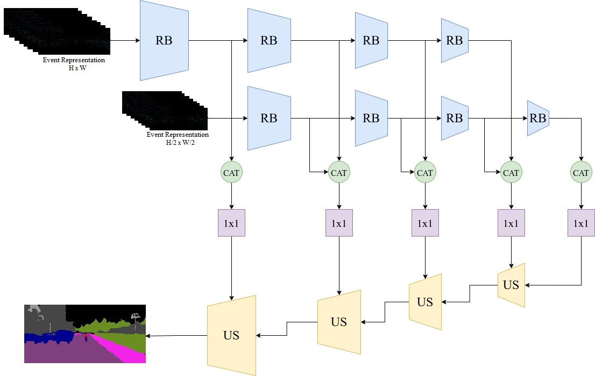
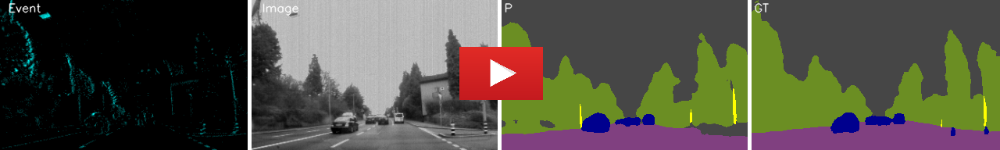
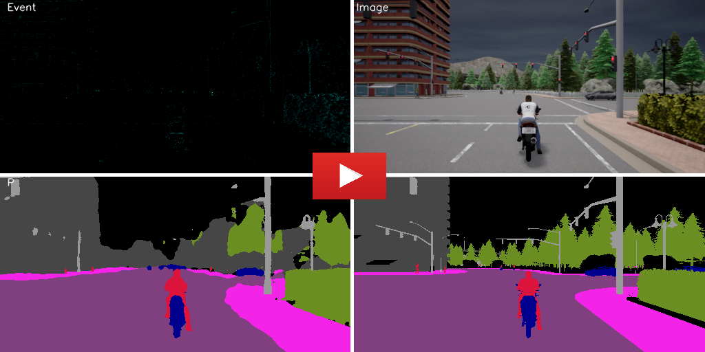

# Event-Based Semantic Segmentation

This work proposes a pyramid-based network for semantic segmentation using an event camera, we evaluate our model on DDD17 dataset[[link](https://github.com/Shathe/Ev-SegNet#readme)] and Event-Scape dataset[[link](https://rpg.ifi.uzh.ch/RAMNet.html)] 

## Abstract
<p align="justify">
Event cameras are bio-inspired sensors. They have outstanding properties compared to frame-based cameras: high dynamic range (120 vs 60), low latency, and no motion blur. Event cameras are appropriate to use in challenging scenarios such as vision systems in self-driving cars and they have been used for high-level computer vision tasks such as semantic segmentation and depth estimation. In this work, we worked on semantic segmentation using an event camera for self-driving cars. This work introduces a new event-based semantic segmentation network and we evaluate our model on DDD17 dataset and Event-Scape dataset which was produced using Carla simulator.
</p>

**The paper is available** [here](https://link.springer.com/chapter/10.1007/978-3-031-43763-2_10) 

**If you use this work in an academic context, please cite the following publication:**
```
Ghasemzadeh, M., Shouraki, S.B. 
Semantic Segmentation Using Events and Combination of Events and Frames.
In: Ghatee, M., Hashemi, S.M. (eds) Artificial Intelligence and Smart Vehicles. ICAISV 2023.
Communications in Computer and Information Science, vol 1883. Springer, Cham.
https://doi.org/10.1007/978-3-031-43763-2_10
```

# Network Architecture



# Requirements
* Python 3.7+
* Tensorflow 2.8 + 
* Opencv
* Keras
* segmentation-models


# Dataset

## DDD17 dataset

**The semantic segmentation classes in DDD17 dataset:** flat, construction+sky, object,  nature,  human, and vehicle

**A video from results:**

[](https://youtu.be/AL911t6QpBA)

P: Our network prediction, GT: Ground Truth

**Training**

Please download DDD17 dataset from [here](https://github.com/Shathe/Ev-SegNet) then extract it in DDD17/Dataset directory
```
cd DDD17
python3 train.py
```

**Weights**

Please download Weights from [here](https://drive.google.com/drive/folders/1o1KrejQ7epF2IynXCzF_kk67h1ZcqoU5?usp=drive_link) , then copy it in DDD17 directory

**Evaluating**

For revealing the network performance, eval.py creates and saves results in DDD17/output directory
```
cd DDD17
python3 eval.py
```


## Event-Scape dataset

**The semantic segmentation classes in Event-Scape dataset:** ‫‪Unlabeled‬‬‫‪ +‬‬ ‫‪Sky,‬‬ ‫‪Wall‬‬‫‪ +‬‬ ‫‪Fence‬‬ ‫‪+‬‬ ‫‪Building‬‬, Person‬‬, sign‬‬‫‪Traffic‬‬ ‫‪+‬‬ ‫‪Pole‬‬, ‫‪Road‬‬, ‫‪Sidewalk‬‬, Vegetation‬‬, Vehicle‬‬,

**A video from results:**

[](https://youtu.be/Q1pNcZDNzos)

P: Our network prediction, GT: Ground Truth

**Training**

The original Event-Scape dataset is available [here](https://rpg.ifi.uzh.ch/RAMNet.html) for training and evaluating the network, download the dataset then extract it in Event-Scape/Dataset directory.

```
cd Event-Scape
python3 train.py
```

**Pre-trained Weights**

Please download Weights from [here](https://drive.google.com/drive/folders/1SdLbta7b6hMZ-CdAteL72taKPw1MqV2C?usp=drive_link) , then copy it in Event-Scape directory

**Evaluating**

For revealing the network performance, eval.py creates and saves results in Event-Scape/output directory
```
cd Event-Scape
python3 eval.py
```


